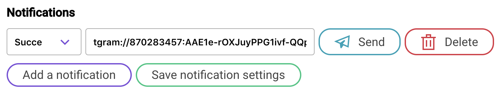
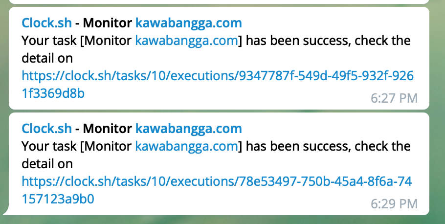

# Notification

Clock.sh use [apprise](https://github.com/caronc/apprise) to send notifications, please check this [wiki](https://github.com/caronc/apprise/wiki) for apprise's format.

For example, if you want to send to telegram when job run success, you need to write `**tgram**://**{bot_token}**/**{chat_id}**/` to `send to…` form field(Check [Notify Telegram](https://github.com/caronc/apprise/wiki/Notify_telegram) for more information).

Then when your job run succes, you will receive a message like this:

If you have further questions, feel free to open a ticket here: https://github.com/clock-sh/ticket .

