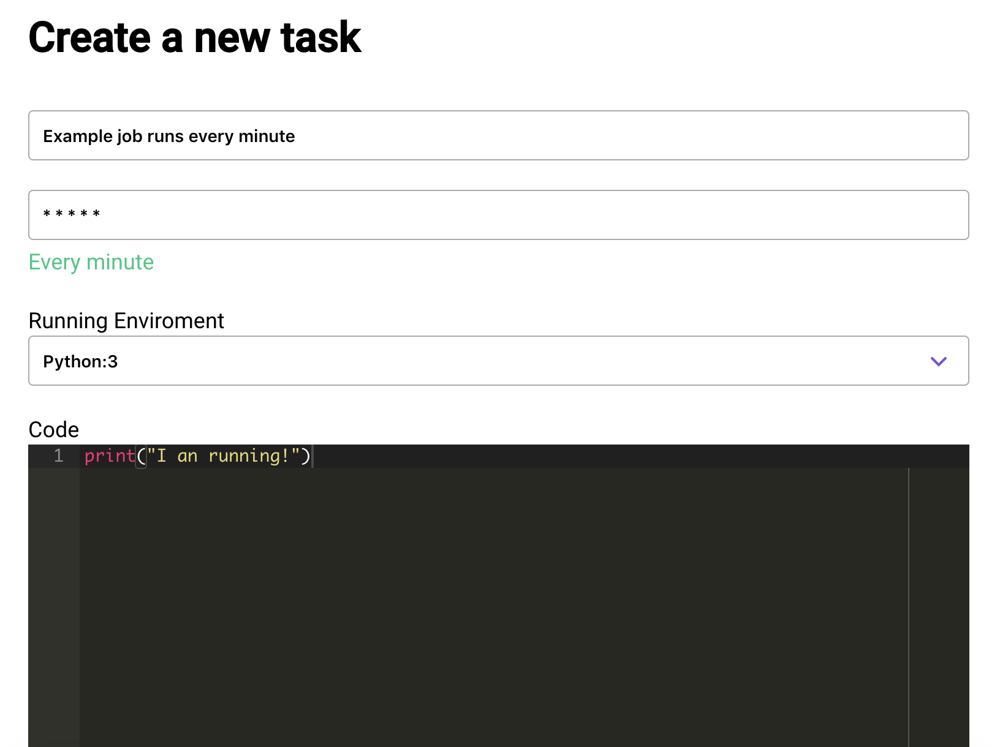

# Welcome to Clock.sh

This is the documentation for [Clock.sh](https://clock.sh).

## What is Clock.sh?

Clock.sh is a cronjob hoster, you can write script here(clock.sh support multi languages), clock.sh will run your script based on your crontab.

## Features

- Support multi language with popular third package lib;
- Collect your job's log(stdout and stderr);
- Crontab explanation;
- Support notifications when a job failed or ran, the notification can be sent to 20+ popular platforms;