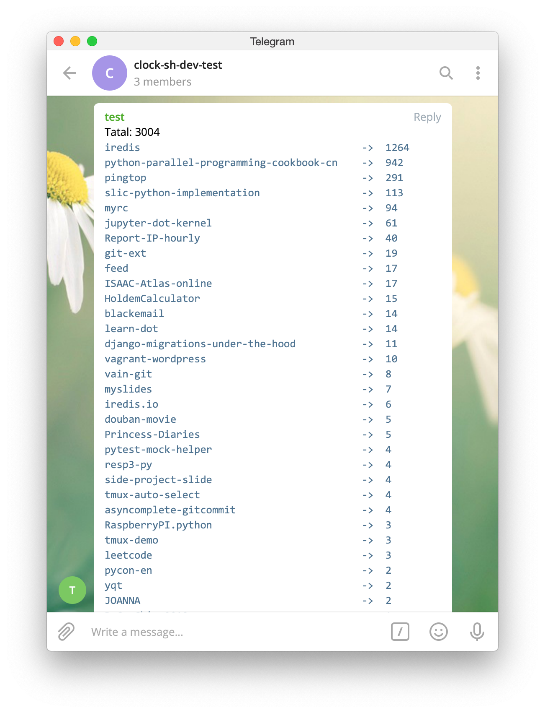

## Watch Your HTTPS Cert

```Python
"""
Check if a SSL cert will expire in 3 days.

Note:
Clock.sh's time limit is 3min.
"""
import sys
from urllib.request import ssl, socket
from datetime import datetime, timedelta

today = datetime.now()

# You may want to change this
hostnames = [
    "kawabangga.com",
    "clock.sh"
]
port = "443"
alert_alive_days = 3


def check_host_cert(hostname):
    context = ssl.create_default_context()
    with socket.create_connection((hostname, port)) as sock:
        with context.wrap_socket(sock, server_hostname=hostname) as ssock:
            j = ssock.getpeercert()

    expire_str = j["notAfter"]
    expire_date = datetime.strptime(expire_str, "%b %d %I:%M:%S %Y %Z")
    cert_live_time = expire_date - today
    print("{} will expire in {}".format(hostname, cert_live_time))
    ok = cert_live_time > timedelta(days=3)
    return ok


results = [check_host_cert(hostname) for hostname in hostnames]

if all(results):
    sys.exit(0)
else:
    sys.exit(1)
```

## Count Your Github Stars Everyday!

Setup this task at clock.sh, you can receive a telegram message from bot every
afternoon, tell you how many github stars do you have.

This is how it looks like:




```javascript
var token = "13941412333:asdfasdfsadfasdfasdfsdf"; // change this to you telegram bot token!
var chatId = "-1231231231"; // change this to your telegram chat id!

var https = require("https"),
  user = "laixintao", // change this to your github username!
  opts = parseOpts(process.argv.slice(3));

function send2telegram(text) {
  const data = JSON.stringify({
    chat_id: chatId,
    text: text,
    parse_mode: "MarkdownV2",
  });
  console.log("data is: ", data);

  const options = {
    hostname: "api.telegram.org",
    port: 443,
    path: "/bot" + token + "/sendMessage",
    method: "POST",
    headers: {
      "Content-Type": "application/json",
      "Content-Length": data.length,
    },
  };

  const req = https.request(options, (res) => {
    console.log(`statusCode: ${res.statusCode}`);

    res.on("data", (d) => {
      process.stdout.write(d);
    });
  });

  req.on("error", (error) => {
    console.error(error);
  });

  req.write(data);
  req.end();
}

request("/users/" + user, function (res) {
  if (!res.public_repos) {
    console.log(res.message);
    return;
  }
  var pages = Math.ceil(res.public_repos / 100),
    i = pages,
    repos = [];
  while (i--) {
    request("/users/" + user + "/repos?per_page=100&page=" + (i + 1), check);
  }
  function check(res) {
    repos = repos.concat(res);
    pages--;
    if (!pages) output(repos);
  }
});

function request(url, cb) {
  https
    .request(
      {
        hostname: "api.github.com",
        path: url,
        headers: { "User-Agent": "GitHub StarCounter" },
      },
      function (res) {
        var body = "";
        res
          .on("data", function (buf) {
            body += buf.toString();
          })
          .on("end", function () {
            cb(JSON.parse(body));
          });
      }
    )
    .end();
}

function output(repos) {
  var total = 0,
    longest = 0,
    list = repos
      .filter(function (r) {
        total += r.stargazers_count;
        if (r.stargazers_count >= opts.thresh) {
          if (r.name.length > longest) {
            longest = r.name.length;
          }
          return true;
        }
      })
      .sort(function (a, b) {
        return b.stargazers_count - a.stargazers_count;
      });

  if (list.length > opts.limit) {
    list = list.slice(0, opts.limit);
  }

  var displayMessage = "\nTatal: " + total + "\n";
  displayMessage += "```\n";
  displayMessage += list
    .map(function (r) {
      return (
        r.name +
        new Array(longest - r.name.length + 4).join(" ") +
        " ->  " +
        r.stargazers_count
      );
    })
    .join("\n");
  displayMessage += "\n```";
  console.log("-->" + displayMessage);
  console.log("sending to telegram...");
  send2telegram(displayMessage);
}

function parseOpts(args) {
  var opts = {
    thresh: 1,
    limit: Infinity,
  };
  args.forEach(function (a, i) {
    var next = args[i + 1];
    if (a === "-t") {
      opts.thresh = parseInt(next, 10) || 1;
    } else if (a === "-l") {
      opts.limit = parseInt(next, 10) || Infinity;
    }
  });
  return opts;
}
```

> The original node script is from:
> https://gist.github.com/yyx990803/7745157
